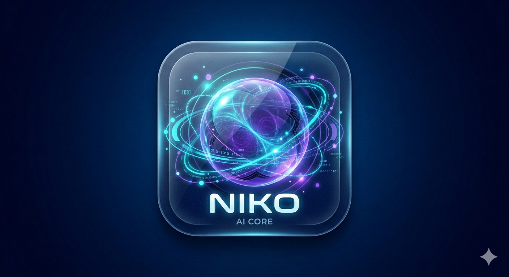
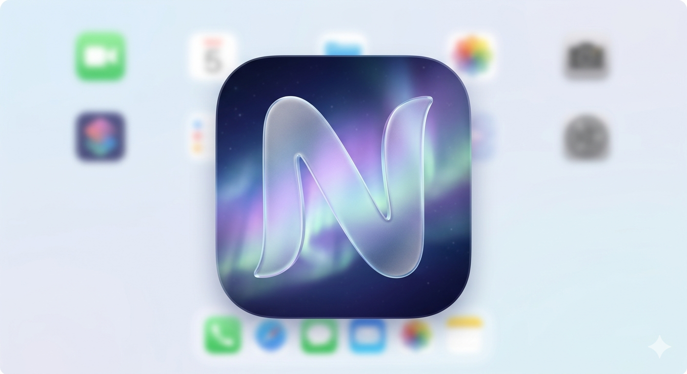

# Niko Mobile App

Niko, Android cihazlar için geliştirilmiş, sesli komutlarla çalışan kişisel bir yapay zeka asistanıdır. Gelişmiş ses tanıma özellikleri ve yapay zeka entegrasyonu sayesinde telefonunuzu dokunmadan kontrol etmenizi sağlar.

## ✨ Öne Çıkan Özellikler

| Kategori | Detaylar |
| --- | --- |
| 🧠 **Yapay Zeka & İletişim** | 🎙️ **Sesli Sohbet & Model Seçimi:** Doğal dilde akıcı diyaloglar ve AI tabanlı akıllı yanıtlar. Farklı **LLM modelleri** arasında anlık geçiş imkanı.  💭 **Düşünce Akışı & Kişilik:** AI'nın yanıt üretme sürecini gerçek zamanlı izleme. Normalden filozofa, agresiften romantiğe **6 farklı karakter** modu. |
| 📱 **Akıllı Cihaz Kontrolü** | 📞 **İletişim Otomasyonu:** Sesli komutla arama yönetimi ve **WhatsApp** üzerinden otomatik mesaj gönderimi.  🛠️ **Sistem Yönetimi:** Wi-Fi, BT ve parlaklık ayarları. **DuckDuckGo** ile web araması ve arşiv yönetimi. |
| 🎨 **Tasarım (UI/UX)** | 💎 **Avant-Garde Arayüz:** Glassmorphism ve premium mikro-etkileşimler. Nefes alan dinamik **Voice Orb** animasyonu.  📳 **Haptik & İstatistik:** 5 seviyeli premium haptik geri bildirim. Animasyonlu sayaçlar, grafiksel analizler ve **JWT tabanlı** profil yönetimi. |
| ⚙️ **Altyapı & Güvenlik** | 🚀 **Dinamik Dağıtım:** Uygulama içi kesintisiz **APK kurulumu**. GitHub üzerinden otomatik senkronizasyon yeteneği.  🛡️ **Erişim & Denetim:** Geliştirici terminali, 6 haneli e-posta doğrulamalı kriptolu oturum ve gelişmiş admin yetkileri. |

## 🚀 Kurulum ve Gereksinimler

> 💡 **Önemli Not:** Niko'nun akıllı cevaplar üretebilmesi için bir **LLM (Ollama vb.)** sunucusuna bağlı olması gerekmektedir. Sistem yerel ağda veya Cloudflare Tunnel üzerinde çalışan `main.py` ile haberleşir.

### 🛠️ Teknik Gereksinimler

| 🤖 Cihaz | 🌐 Bağlantı | 🖥️ Backend |
| :---: | :---: | :---: |
| **Android 8.0+** Android Oreo (8.0) ve üzeri cihazlarla tam uyumlu. | **Aktif İnternet** Yapay zeka servisleri için internet erişimi. | **API & Sunucu** Aktif çalışan API katmanı ve sunucu bağlantısı. |

### 🚀 Kurulum Adımları

1. **APK Yükleme & Güvenlik:** En son `niko.apk` dosyasını Releases bölümünden indirin. Yükleme sırasında Android'in sorduğu **"Bilinmeyen Kaynaklar"** iznini onaylamanız gerekir.
2. **Erişim İzinlerini Tanımlama:** Uygulamayı ilk başlattığınızda mikrofon, rehber, telefon ve takvim gibi kritik izinleri onaylayarak tam fonksiyonelliği aktif edin.
3. **Backend & Senkronizasyon:** Niko, GitHub üzerindeki `version.json` dosyasından API adresini otomatik çeker. Yerel kurulum kullanıyorsanız bağlantı ayarlarını kontrol edin.

> ⚠️ **Kritik Uyarı:** İnternet veya sunucu bağlantısı koparsa Niko'nun yanıt süresi uzayabilir veya sistem hata verebilir.

## 🔐 Gerekli İzinler ve Kullanım Amaçları

| Kategori | Teknik İzin | Kullanım Amacı |
| --- | --- | --- |
| 🎙️ **Mikrofon** | `RECORD_AUDIO` | Sesli komutları algılamak ve AI ile doğal konuşma başlatmak için. |
| 👥 **Rehber** | `READ_CONTACTS` | "Ahmet'i ara" gibi komutlarda isimleri numaralarla eşleştirmek için. |
| 📞 **Telefon** | `CALL_PHONE`, `READ_CALL_LOG` | Sesli arama başlatmak ve son çağrı geçmişine erişebilmek için. |
| 📸 **Kamera** | `CAMERA` | "Fotoğraf çek" komutuyla anlık görüntü yakalayabilmek için. |
| 💾 **Depolama** | `READ/WRITE_EXTERNAL_STORAGE` | Profil fotoğrafı seçimi ve APK güncellemelerini kurabilmek için. |
| 📅 **Takvim** | `READ/WRITE_CALENDAR` | Sesli komutla hatırlatıcılar oluşturmak ve takvim yönetimi için. |
| 🌐 **İnternet** | `INTERNET`, `ACCESS_NETWORK_STATE` | Yapay zeka sunucusuyla iletişim ve web aramaları için. |
| 📶 **Bağlantılar** | `WIFI`, `BLUETOOTH` | Wi-Fi ve Bluetooth'u sesli komutla kontrol edebilmek için. |
| ⏰ **Alarm** | `SET_ALARM` | Sesli komutla alarm kurmak ve yönetmek için. |
| 💡 **Sistem Ayarları** | `WRITE_SETTINGS` | Ekran parlaklığı gibi sistem ayarlarını yönetebilmek için. |
| ♿ **Otomasyon** | `Accessibility Service` | WhatsApp mesajlarını otomatik olarak göndermek için. |

## 📖 Kullanım Rehberi

1. **Başlatma & Orb Deneyimi:** Uygulamayı açtığınızda merkezde bulunan dinamik **Voice Orb** sizi karşılar. Bu küre, asistanınızın durumunu temsil eder.
2. **Sesli Aktivasyon:** Cihazınıza **"Niko"** diyerek seslenin veya mikrofon simgesine dokunun. Orb, parlamaya başladığında dinleme moduna geçmiştir.
   > 💡 **İpucu:** Daha net bir algılama için komutları doğrudan ve anlaşılır bir tonda söylemeniz önerilir.
3. **Komut Verme:** İsteğinizi söyleyin. Niko talebinizi işlerken görsel animasyonlar sunar ve ardından sesli/yazılı yanıt verir. *(Örn: "Müziği başlat", "Ahmet'i ara...")*

## 🗣️ Kullanılabilir Komutlar

| Kategori | Komut Örnekleri |
| --- | --- |
| 👤 **Kimlik & Sohbet** | "Adın ne?", "Kendini tanıt", "Nasılsın?" |
| 📞 **Arama & Mesaj** | "[İsim] ara", "Son arananları göster", "WhatsApp üzerinden [İsim]'e [Mesaj] gönder" |
| 📅 **Zaman & Tarih** | "Saat kaç?", "Bugün günlerden ne?", "Tarihi söyle" |
| 🛠️ **Araçlar & Sistem** | "Kamerayı aç", "Wi-Fi / Bluetooth aç/kapat", "Ayarları aç" |
| 🎵 **Medya & Müzik** | "Müziği başlat/durdur", "Sıradaki şarkı", "Spotify aç" |
| ⏰ **Alarm & Hatırlatıcı** | "Sabah 7'ye alarm kur", "10 dakika sonra hatırlat", "Alarmları göster" |
| 📜 **Sohbet Geçmişi** | "Geçmişi göster/temizle", "Sohbet geçmişini oku"   ⚠️ *Geçmişi temizle komutu kalıcıdır.* |
| 🔄 **Sistem & Sürüm** | "Güncelleme kontrol", "Sürüm bilgisi", "Yeni versiyon var mı?" |

## 🛠️ Teknoloji Yığın Entegrasyonu

| Katman | Teknolojiler ve İşlevleri |
| --- | --- |
| 📱 **Mobil Çekirdek** | • **Java:** Saf performans odaklı sistem geliştirme. • **Accessibility Service:** WhatsApp için gelişmiş otomasyon. • **ExecutorService:** Asenkron komut ve görev yönetimi. • **SharedPreferences:** Yerel durum takibi. |
| 🧠 **Yapay Zeka & Ses** | • **Ollama (LLM):** RefinedNeuro/RN_TR_R2 yerel zeka modeli. • **Edge-TTS:** Bulut tabanlı, insan kulağına en yakın ses sentezi. • **Speech Recognizer:** Cihaz içi yüksek hassasiyetli ses algılama. • **Base64 Streaming:** Akıcı sesli yanıtlar için optimize iletim. |
| 🌐 **Backend & Ağ** | • **FastAPI & Uvicorn:** Python tabanlı API motoru. • **Cloudflare Tunnel:** Güvenli AI iletişim köprüsü. • **DuckDuckGo API:** Gerçek zamanlı web verisi. • **HTTP URL Connection:** Optimize edilmiş veri alışverişi. |
| 🚀 **DevOps & Dağıtım** | • **GitHub Actions:** Otomatik build, test ve APK dağıtım. • **Workflow Automation:** Akıllı versiyon kontrolü. • **Remote Sync:** GitHub üzerinden dinamik API güncellemeleri. |

## Tasarım ve İkonlar

| İkon | Adı | İkon | Adı |
| :---: | :---: | :---: | :---: |
|  | Icon 01 |  | Icon 02 |
|  | Icon 03 |  | Icon 04 |
|  | Icon 05 |  | Icon 06 |
|  | Icon 07 |  | Icon 08 |

## 📂 Proje Dosya Yapısı

| Modül | Klasör/Dosyalar | Açıklama |
| --- | --- | --- |
| 🛡️ **Çekirdek & Mantık** | `MainActivity.java` `AndroidManifest.xml` | Uygulamanın beyni; ses tanıma, TTS ve API yönetim merkezi. Sistem izinleri, servis tanımlamaları ve uygulama kimliği. |
| 💎 **Görsel & Animasyon** | `activity_main.xml` `orb_gradient.xml` vb. | Ana UI katmanı ve asistan etkileşim bölgeleri. Voice Orb'un dinamik gradyan ve parlama efektleri. |
| 🖼️ **UI Bileşenleri** | `model_item_bg.xml` `mic_button.xml` vb. | Glassmorphism katmanları ve arka plan stilleri. Tıklanabilir interaktif elemanlar ve ikonlar. |
| 👤 **Kimlik & Profil** | `auth_input_bg.xml` `profile_card...xml` | Kimlik doğrulama, butonlar ve giriş arayüzü. Profil görüntüleme, yetki kartları. |
| 🛠️ **Sistem & Admin** | `terminal_container...` `file_paths.xml` | Geliştirici terminali, log pencereleri. Sistem yapılandırma ve dosya sağlayıcıları (FileProvider). |

## 🗺️ Stratejik Yol Haritası

| Aşama | Modül Adı | Durum | Özellikler & Kabiliyetler |
| :---: | --- | :---: | --- |
| **I** | **Çekirdek Zeka** | 🟢 TAMAMLANDI | Gelişmiş NLP, Çevrimdışı Komut, E-Posta Doğrulama, JWT Güvenliği |
| **II** | **Avant-Garde Arayüz** | 🟢 TAMAMLANDI | Buzlu Cam Tasarımı, Dinamik Ses Küresi, Model Seçici, Mesaj Arşivi |
| **III** | **Otomasyon** | 🟢 TAMAMLANDI | Spotify/Medya Entegrasyonu, WiFi/BT Kontrol, Akıllı Alarm Sistemi |
| **IV** | **Görsel Zeka** | 🔵 PLANLANDI | Kamera Tabanlı Nesne Tanıma, Sahne Analizi, Görsel İşleme |
| **V** | **Küresel Erişim** | 🔵 PLANLANDI | Anlık Çoklu Dil Çeviri, OCR Doküman Analiz, Hibrit Bulut Senkronizasyonu |

## ✉️ İletişim & Destek

| Kaynak | Bağlantı |
| --- | --- |
| 👨‍💻 **Geliştirici** | [Memati8383](https://github.com/Memati8383) |
| 📁 **Repository** | [niko-with-gemini GitHub Sayfası](https://github.com/Memati8383/niko-with-gemini) |
| ⭐ **Destek** | Projeyi beğendiyseniz GitHub üzerinden **Star** verebilirsiniz! |

---

  <b>Niko</b> ile geleceğin asistanını keşfedin.  
  Built with ❤️ by <b>Memati8383</b>

